# CoCo as a GitHub Actions Agent — PoC

This repository demonstrates **Cortex Code (CoCo)** running autonomously inside
GitHub Actions. A `scan` workflow detects bugs and raises GitHub issues prefixed
`[coco-agent]`. The `fix` workflow triggers automatically when such an issue is
opened, runs CoCo headlessly, commits the changes to a branch, opens a PR, and
auto-merges it.

---

## Getting Started

Choose your path:

### Easy Path — Let CoCo walk you through it

1. **[Create your repo from this template](#create-your-repo-from-this-template)**
2. **[Disable workflows](#disable-workflows-before-first-push)** before your first push
3. Open **[Cortex Code](https://docs.snowflake.com/en/user-guide/cortex-code/cortex-code)** inside your cloned repo
4. Type: **"Set up the coco agent"**

CoCo will ask for your Snowflake account and GitHub org/repo details, run the
Snowflake setup script, help you configure repository secrets, and optionally
walk you through the demo — all with confirm-before-proceed checkpoints.

### Detailed Path — Manual step-by-step

Follow the sections below for a full breakdown of every setup step.

---

## Prerequisites

| Tool | Purpose | Install |
|---|---|---|
| [`snow` CLI](https://docs.snowflake.com/en/developer-guide/snowflake-cli/installation/installation) | Run the parameterised Snowflake setup SQL | `pip install snowflake-cli` |
| [`gh`](https://cli.github.com/) | GitHub auth, view issues/PRs, manage workflows | See [install docs](https://cli.github.com/) |
| [`cortex`](https://docs.snowflake.com/en/user-guide/cortex-code/cortex-code) | Run the coco-agent skill interactively | Available inside Snowflake |
| [`uv`](https://docs.astral.sh/uv/) | Run the demo app locally *(optional)* | `curl -LsSf https://astral.sh/uv/install.sh \| sh` |

**Snowflake account requirements:** Cortex LLM access enabled on your account.
See [Cortex LLM availability](https://docs.snowflake.com/en/user-guide/snowflake-cortex/llm-functions) for regional model support.

---

## Progress Checklist

- [x] `.github/workflows/cortex-scan.yml` — scan on push/schedule, raises issues via `gh issue create`
- [x] `.github/workflows/cortex-fix.yml` — fix on `[coco-agent]` issue opened, opens PR + auto-merges
- [x] `demo/app.py` — Streamlit app with seeded `O_TOTALPRICE_USD` bug
- [x] `.cortex/prompts/scan.md` — CoCo scan prompt (uses `gh issue create`)
- [x] `.cortex/prompts/fix.md` — CoCo fix prompt (substituted via envsubst)
- [x] `Dockerfile` — Ubuntu 24.04 + `gh` CLI + CoCo CLI

---

## Autonomous Loop

```mermaid
flowchart TD
    subgraph Repo["Your GitHub Repository"]
        PUSH["Push to main"]
        ISSUE["&#91;coco-agent&#93; issue\ncreated automatically"]
        PR["Fix PR opened\nby the agent"]
    end

    subgraph Actions["GitHub Actions"]
        SCAN["cortex-scan workflow\nruff + Cortex analysis"]
        FIX["cortex-fix workflow\nCortex-generated patch"]
    end

    subgraph SF["Snowflake Cortex"]
        LLM["LLM\n(WORKLOAD_IDENTITY)"]
    end

    PUSH -->|triggers| SCAN
    SCAN <-->|OIDC auth| LLM
    SCAN -->|creates| ISSUE
    ISSUE -->|triggers| FIX
    FIX <-->|OIDC auth| LLM
    FIX -->|opens| PR
    PR -->|developer merges| PUSH
```



---

## Scan & Fix Behaviour

### Issue splitting — least-conflict path

When the scan finds multiple bugs, each issue is scoped to one location
so that parallel fix agents produce non-conflicting PRs:

| Scenario | Rule | Reason |
|---|---|---|
| Same bug pattern in two different functions | Two separate issues | Diffs don't overlap → independent PRs, each auto-mergeable |
| Two bugs inside the same function body | One combined issue | Fixes would overlap → safer as a single PR |
| Bugs in different files | Always separate | No conflict possible |

### Priority ordering

Issues are emitted in priority order so serial fix agents tackle the most
dangerous problems first:

| Priority | Category | Label |
|---|---|---|
| P0 | Security (SQL injection, hardcoded credentials, insecure auth) | `coco-agent-security` |
| P1 | Correctness (wrong names, undefined refs, logic errors) | `coco-agent-correctness` |

Every issue also carries the `coco-agent` trigger label.

### Least-conflict fix path

Before branching, the fix agent checks for open PRs already touching the
same file. If one exists, the new branch is based on that PR's branch
rather than `main`, forming a fix chain:

```
main ← fix/issue-1 ← fix/issue-2   (same file, chained)
main ← fix/issue-3                  (different file, independent)
```

This prevents merge conflicts when multiple fixes land in parallel.

### Controlling what the agent scans

Add a `.agentignore` file at the repository root to exclude paths from
scanning. Syntax follows `.gitignore` rules:

```
# Skip generated and vendored code
__pycache__/
.venv/
vendor/
dist/
```

The fix agent does **not** read `.agentignore` — if an issue was raised for
a file, the fix proceeds regardless.

---

## Create Your Repo From This Template

1. Go to [github.com/Snowflake-Labs/github-coco-agent](https://github.com/Snowflake-Labs/github-coco-agent)
2. Click **"Use this template" → "Create a new repository"**
3. Choose your org/username and repo name
4. Clone your new repo:
   ```bash
   git clone git@github.com:<your-org>/<your-repo>.git
   cd <your-repo>
   ```

### Disable workflows before first push

Prevent scan/fix workflows from running before Snowflake is configured — they
will fail with authentication errors until setup is complete.

**Via GitHub UI**: Actions tab → select a workflow → **"..." menu → Disable workflow**

**Via CLI** (`gh` authenticated, run from inside the repo):
```bash
gh workflow disable cortex-scan.yml
gh workflow disable cortex-fix.yml
```

### Enable workflows after setup

Once Snowflake setup is complete and repository secrets are configured:

**Via GitHub UI**: Actions tab → select a workflow → **Enable workflow**

**Via CLI**:
```bash
gh workflow enable cortex-scan.yml
gh workflow enable cortex-fix.yml
```

> After enabling, push any small change to `main` to verify the scan workflow
> authenticates successfully before triggering the full demo.

---

## Snowflake Authentication (OIDC / WIF)

Both workflows use `snowflakedb/snowflake-cli-action@v2` with `use-oidc: true`.
This exchanges the short-lived GitHub OIDC token for a Snowflake session — no
long-lived Snowflake secret stored in GitHub.

### Snowflake setup

Run the parameterized setup script. Replace `MYORG` with your prefix and
`myorg/github-coco-agent` with your GitHub org/repo:

```bash
snow sql -f snowflake/setup.sql \
  -D "PREFIX=MYORG" \
  -D "REPO_PATH=myorg/github-coco-agent" \
  -c <your-snowflake-connection>
```

This creates the role, warehouse, and WORKLOAD_IDENTITY user. Safe to re-run.

To tear down:
```bash
snow sql -f snowflake/teardown.sql -D "PREFIX=MYORG" -c <your-connection>
```

---

## Repository Secrets

Set in **Settings → Secrets and variables → Actions**:

| Secret | Value |
|---|---|
| `SNOWFLAKE_ACCOUNT` | Your Snowflake account identifier |
| `SNOWFLAKE_ROLE` | `<PREFIX>_GITHUB_COCO_AGENT_ROLE` |
| `SNOWFLAKE_WAREHOUSE` | `<PREFIX>_GITHUB_COCO_AGENT_WH` |

Replace `<PREFIX>` with the prefix you used in `snowflake/setup.sql`.

> `SNOWFLAKE_USER` is not needed — the GitHub Actions OIDC token is used directly.
> `SNOWFLAKE_AUDIENCE` is set automatically by the Snowflake CLI action (`use-oidc: true`).

---

## Token Permissions

Both workflows declare minimal `permissions:` blocks:

| `permissions:` key | Why |
|---|---|
| `id-token: write` | Request OIDC token for Snowflake WIF |
| `contents: write` | Push feature branches (`cortex-fix.yml` only) |
| `issues: write` | Create issues (`cortex-scan.yml`) and post comments (`cortex-fix.yml`) |
| `pull-requests: write` | Create and merge PRs (`cortex-fix.yml` only) |

---

## Tool Permission Controls

CoCo has a layered permission system for controlling which tools execute
automatically vs. prompt for approval vs. are blocked entirely.

### `--dangerously-allow-all-tool-calls` / `--bypass`

Auto-approves **every** tool call with no prompts. These are aliases.

```bash
# main CLI
cortex --print "task" --dangerously-allow-all-tool-calls

# ACP server mode
cortex acp serve --bypass
```

Appropriate for PoC/CI where the runner environment is already isolated.

---

### `--allowed-tools` — per-tool whitelist

Tools in this list run **without prompting**; everything else still asks.
Supports glob patterns inside `Bash(...)`:

```bash
cortex --print "task" \
  --allowed-tools "Bash(git *)" \
                  "Bash(cortex *)" \
                  "Read" \
                  "Edit" \
                  "Write" \
                  "Bash(uv run *)"
```

| Spec | Meaning |
|---|---|
| `"Read"` | All file reads, no prompt |
| `"Edit"` | All file edits, no prompt |
| `"Write"` | All file writes, no prompt |
| `"Bash(git *)"` | Any `git` subcommand, no prompt |
| `"Bash(git commit *)"` | Only `git commit`, nothing else in git |
| `"Bash(*)"` | All bash — equivalent to `--dangerously-allow-all-tool-calls` for bash |
| `"Task(Explore)"` | Only the Explore subagent, no prompt |

---

### `--disallowed-tools` — hard block

Completely **removes** a tool from the model's context. CoCo cannot even
attempt to use it:

```bash
cortex --print "task" \
  --disallowed-tools "Bash(rm *)" \
                     "Bash(curl *)" \
                     "Task(Explore)"
```

Useful for preventing destructive operations in CI.

---

### `--auto-accept-plans`

Skips plan-mode confirmation prompts without user input:

```bash
cortex --print "task" \
  --dangerously-allow-all-tool-calls \
  --auto-accept-plans
```

---

### `--sql-read-only`

Restricts the built-in SQL tool to `SELECT` only — rejects DDL/DML.
Also controllable via env var and at runtime:

```bash
cortex --print "task" --sql-read-only
# or via env var
CORTEX_CLIENT_READ_ONLY=true cortex --print "task"
# toggle inside a live session
/sql-readonly on|off
```

---

### `permissions.json` — persistent interactive cache

Stored at `~/.snowflake/cortex/permissions.json`. Interactive permission
answers are cached per working directory, keyed by tool type and command:

```json
{
  "working_dirs": {
    "/path/to/repo": {
      "cache": {
        "{\"bash_type\":\"base_command\",\"command\":\"git\",\"type\":\"bash\"}": {
          "result": "granted"
        },
        "{\"tool_type\":\"web_fetch\",\"type\":\"web_access\"}": {
          "result": "granted"
        }
      }
    }
  }
}
```

In CI, pre-seeding this file lets you bypass interactive prompts for
specific tools without using `--dangerously-allow-all-tool-calls`.

---

### Recommended config for the GitHub Actions workflow

| Use case | Flags |
|---|---|
| **PoC** | `--dangerously-allow-all-tool-calls --auto-accept-plans` |
| **Production (code changes)** | `--allowed-tools "Bash(git *)" "Bash(cortex *)" "Read" "Edit" "Write" --auto-accept-plans` |
| **Analysis / comment-only** | Above + `--sql-read-only` + `--disallowed-tools "Bash(git push *)"` |

The workflows in this repo use the PoC flag with a comment pointing to the
production-hardened `--allowed-tools` alternative.

---

## Repository Layout

```
.github/
  workflows/
    cortex-scan.yml   # scan on push/schedule → gh issue create
    cortex-fix.yml    # fix on @coco-agent comment → PR → merge
.cortex/
  prompts/
    scan.md           # scan prompt (uses gh CLI)
    fix.md            # fix prompt (substituted with issue title/body)
  skills/
    github-coco-agent/
      SKILL.md
      demo/
        SKILL.md     # Demo sub-skill (materializes demo app on demand)
        templates/   # Demo app templates (app.py, pyproject.toml, tests/)
      references/
        oidc.md
        troubleshooting.md
demo/
  app.py              # Streamlit app — seeded O_TOTALPRICE_USD bug
  requirements.txt
  README.md
snowflake/
  setup.sql          # Parameterized Snowflake setup (snow sql -D)
  teardown.sql       # Reverse teardown
AGENTS.md            # Commit conventions and agent prompt standards
connections.toml.template  # Template for ~/.snowflake/connections.toml
Dockerfile            # Ubuntu 24.04 + gh CLI + CoCo CLI
```

---

## Demo Walkthrough

The demo sub-skill scaffolds a small Python app with intentional issues and walks
you through the full scan-fix loop with confirm-before-proceed checkpoints at each stage.

**To start the demo**: open Cortex Code in your repo and say `"run the demo"`.

### What happens

| Beat | What you see |
|---|---|
| 1 — Materialize | `app.py`, `pyproject.toml`, `tests/` written and pushed |
| 2 — Scan | `cortex-scan` workflow creates `[coco-agent]` issues |
| 3 — Fix | `cortex-fix` workflow opens a fix PR |
| 4 — Review | Review and merge the PR |
| 5 — Teardown | Demo files removed *(optional)* |

The demo skill reads templates from `.cortex/skills/github-coco-agent/demo/templates/`.

---

## References

- [Snowflake CLI GitHub Action](https://docs.snowflake.com/en/developer-guide/snowflake-cli/cicd/github-action)
- [Snowflake WORKLOAD_IDENTITY user setup](https://docs.snowflake.com/en/user-guide/workload-identity-federation)
- [GitHub Actions OIDC hardening](https://docs.github.com/en/actions/security-for-github-actions/security-hardening-your-deployments/about-security-hardening-with-openid-connect)
- [snowflakedb/snowflake-cli-action](https://github.com/snowflakedb/snowflake-cli-action)
