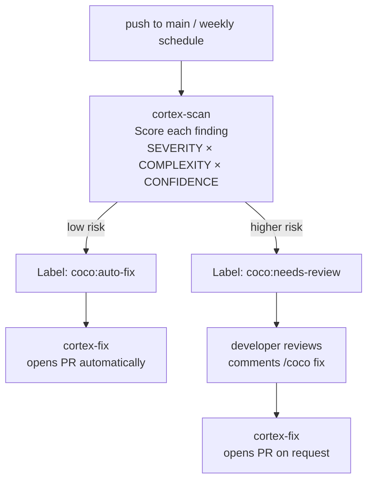

# Agentic DevOps with Snowflake CoCo — GitHub Actions

> A hardened template for running CoCo as an autonomous scan-issue-fix agent
> on GitHub Actions. Scan every push, score each finding, auto-fix the safe
> ones, and route the rest to human review.

> [!IMPORTANT]
> Requires Cortex Code (CoCo) **beta channel**, version
> `1.1.9+204229.0400c522997b` or later.
> The workflows install from the beta channel automatically (`CORTEX_CHANNEL=beta`).
> Verify: `cortex exec --version`

This repository is provisioned by the
[`$devops-coco-agents:scaffold-for-github`](https://github.com/Snowflake-Labs/devops-snowflake-coco-agents)
skill — you do not set it up manually.

---

## What's in this repo

| File | Purpose |
|------|---------|
| `.github/workflows/cortex-scan.yml` | Scan Python files on push/schedule, route findings by severity |
| `.github/workflows/cortex-fix.yml` | Auto-fix issues labeled `coco:auto-fix`; called by comment-fix |
| `.github/workflows/cortex-comment-fix.yml` | Triggered by `/coco fix` comment on any `coco:needs-review` issue |
| `.github/coco-config.yml` | Fix ceiling policy — change via PR for a full audit trail |
| `.cortex/prompts/scan.md` | IDD-structured scan prompt |
| `.cortex/prompts/fix.md` | IDD-structured fix prompt |
| `.agentignore` | Gitignore-style patterns the scan agent skips |
| `connections.toml.template` | Reference for the Snowflake connection used in CI |

---

## Quick start

1. Install [Cortex Code (CoCo)](https://docs.snowflake.com/en/user-guide/cortex-code/cortex-code)
2. Install the scaffold plugin:
   ```bash
   cortex plugin install https://github.com/Snowflake-Labs/devops-snowflake-coco-agents
   ```
3. In the CoCo chat panel:
   ```text
   scaffold for agentic devops with GitHub
   ```
   or: `$devops-coco-agents:scaffold-for-github`

The scaffold walks through six guided steps — repo creation, OIDC provisioning,
secrets, branch protection — and lands you here in under 10 minutes.

---

## How it works



---

## Smart fix mode

The fix ceiling is controlled by `.github/coco-config.yml`:

```yaml
fix_mode:
  max_auto: conservative  # off | conservative | aggressive
```

| Ceiling | Auto-fix when | Otherwise |
|---------|--------------|-----------|
| `off` | Never | Always `needs-review` |
| `conservative` | severity=low AND complexity=low AND confidence=high | `needs-review` |
| `aggressive` | confidence >= medium | `needs-review` |

Change the ceiling via PR — the git history is your audit trail.
Set `COCO_MAX_AUTO` as a repository variable to override at runtime without a PR.

Every scan run logs the active ceiling to the Actions summary:
```
::notice::Fix ceiling: conservative (source: .github/coco-config.yml)
```

---

## Setup

This repository is set up by the CoCo scaffold skill, which provisions:
- Snowflake SERVICE user, role, and warehouse with OIDC trust (no stored secrets)
- All GitHub secrets and the `COCO_MAX_AUTO` variable
- Branch protection

To scaffold a new project using this template:
```text
scaffold for agentic devops with GitHub
```
or: `$devops-coco-agents:scaffold-for-github`

See the [full scaffold guide](https://snowflake-labs.github.io/devops-snowflake-coco-agents/scaffold/github/).

---

## Customization

**Scan trigger** — `cortex-scan.yml` watches `demo/**` by default (smoke test path).
Change `paths:` to match your codebase:

```yaml
on:
  push:
    branches: [main]
    paths: ["src/**/*.py", "*.py"]   # adapt to your project layout
```

**Scan exclusions** — add patterns to `.agentignore` to skip files or directories.

**Fix ceiling** — edit `.github/coco-config.yml` and merge the PR.

---

## Token scopes

| Secret | Required scopes |
|--------|----------------|
| `GITHUB_TOKEN` (auto) | `repo` — create issues, PRs, labels |
| `SNOWFLAKE_*` secrets | Provisioned by scaffold skill via OIDC |

---

## Contributing

Commits follow [Conventional Commits](https://www.conventionalcommits.org/).
See [AGENTS.md](AGENTS.md) for agent and contributor conventions.
